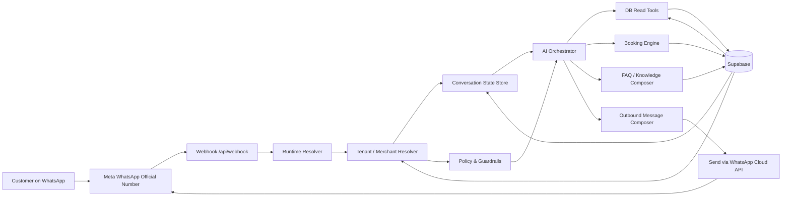
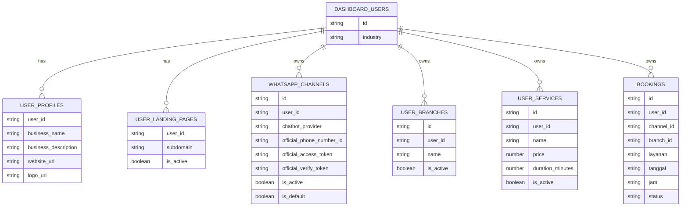
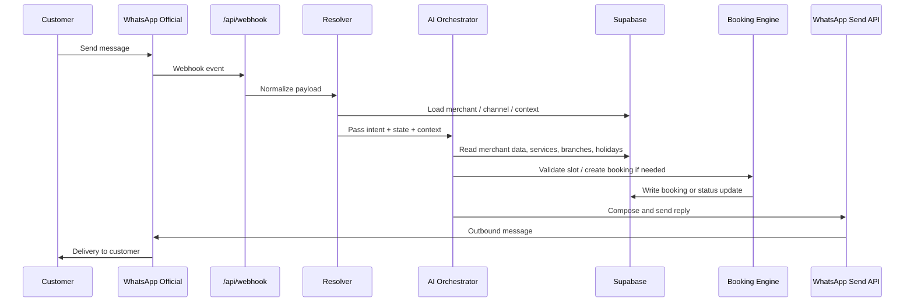

# AI Booking Assistant Architecture

Dokumen ini menjelaskan arsitektur yang lebih cocok untuk pivot produk BookLink:

- 1 WhatsApp Official number sebagai entry point
- banyak merchant di belakangnya
- AI menjawab pertanyaan fleksibel
- database tetap jadi sumber kebenaran
- booking tetap divalidasi oleh rules engine

## 1. High-Level Architecture

## 2. Core Layers

### Entry Layer

- `Meta WhatsApp Official Number`
  - satu nomor shared untuk semua merchant
  - menerima pesan inbound dan status delivery
- `Webhook /api/webhook`
  - entry point yang menerima payload dari Meta
  - sudah ada di [app/api/webhook/route.ts](/Users/robbi-kaspin/Documents/barber_booking/barber-booking/app/api/webhook/route.ts)

### Runtime Layer

- `Runtime Resolver`
  - menentukan apakah payload adalah message, status, atau event lain
  - menormalkan sender, message id, dan official phone number id
- `Tenant / Merchant Resolver`
  - menentukan merchant mana yang sedang dibahas
  - bisa berdasarkan `phone_number_id`, routing keyword, link context, atau history percakapan
  - konteks tenant saat ini sudah ada di [lib/tenant-context.ts](/Users/robbi-kaspin/Documents/barber_booking/barber-booking/lib/tenant-context.ts)
- `Conversation State Store`
  - menyimpan step percakapan
  - menyimpan merchant, cabang, layanan, tanggal, jam, dan intent terakhir

### Intelligence Layer

- `Policy & Guardrails`
  - membatasi jawaban AI agar tidak mengarang data
  - memaksa booking, slot, harga, dan hari libur dibaca dari DB
- `AI Orchestrator`
  - memilih apakah pesan perlu jawaban FAQ, booking flow, reschedule, cancel, atau human handoff
  - menyusun respons akhir dari data dan instruksi sistem
- `DB Read Tools`
  - baca merchant profile
  - baca cabang
  - baca layanan
  - baca jam operasional dan hari libur
  - baca knowledge / FAQ per merchant
- `Booking Engine`
  - validasi slot
  - cek konflik booking
  - membuat booking
  - update status booking
  - kirim reminder

### Delivery Layer

- `Outbound Message Composer`
  - merangkai jawaban AI menjadi pesan WhatsApp yang singkat dan jelas
- `Send via WhatsApp Cloud API`
  - kirim text atau template message
  - credential official sudah di-handle di [lib/whatsapp-channels.ts](/Users/robbi-kaspin/Documents/barber_booking/barber-booking/lib/whatsapp-channels.ts)
  - config official dibaca dari [lib/whatsapp-official.ts](/Users/robbi-kaspin/Documents/barber_booking/barber-booking/lib/whatsapp-official.ts)

## 3. Data Model

## 4. Request Flow

## 5. What AI Can Do

- jawab FAQ merchant
- jelaskan cabang terdekat
- baca jam buka dan hari libur
- sarankan layanan yang cocok
- bantu booking awal
- bantu reschedule atau cancel
- eskalasi ke admin jika konteks tidak jelas

## 6. What AI Must Not Do

- mengarang harga atau layanan
- mengubah booking tanpa validasi engine
- mencampur data merchant A dan merchant B
- mengirim pesan proaktif setelah window aturan WhatsApp tanpa template
- menjawab berdasarkan asumsi kalau DB kosong

## 7. Suggested MVP Boundaries

- 1 shared WhatsApp Official number untuk platform
- 1 merchant = 1 record konteks utama
- multi-branch tersedia sebagai opsi
- booking tetap deterministic
- AI dipakai untuk bahasa dan routing intent
- dedicated number per merchant menjadi add-on premium, bukan default

## 8. Current Code Touchpoints

- Webhook inbound: [app/api/webhook/route.ts](/Users/robbi-kaspin/Documents/barber_booking/barber-booking/app/api/webhook/route.ts)
- Channel resolution: [lib/whatsapp-channels.ts](/Users/robbi-kaspin/Documents/barber_booking/barber-booking/lib/whatsapp-channels.ts)
- Public tenant context: [lib/tenant-context.ts](/Users/robbi-kaspin/Documents/barber_booking/barber-booking/lib/tenant-context.ts)
- Booking logic: [lib/bookings.ts](/Users/robbi-kaspin/Documents/barber_booking/barber-booking/lib/bookings.ts)
- Scheduling logic: [lib/scheduling.ts](/Users/robbi-kaspin/Documents/barber_booking/barber-booking/lib/scheduling.ts)
- Conflict detection: [lib/booking-conflicts.ts](/Users/robbi-kaspin/Documents/barber_booking/barber-booking/lib/booking-conflicts.ts)

## 9. Product Summary

Kalau diringkas, arsitektur baru ini adalah:

> WhatsApp Official shared assistant + AI reasoning layer + database-backed tenant data + deterministic booking engine.

Itu membuat produk lebih mudah dijual, lebih mudah dioperasikan, dan lebih aman daripada chatbot bebas yang tiap merchant punya logic sendiri-sendiri.

## 10. Detailed Booking Flow

Untuk alur percakapan yang lebih spesifik dari greeting sampai konfirmasi booking, lihat:

- [AI Booking Flow](./AI_BOOKING_FLOW.md)
