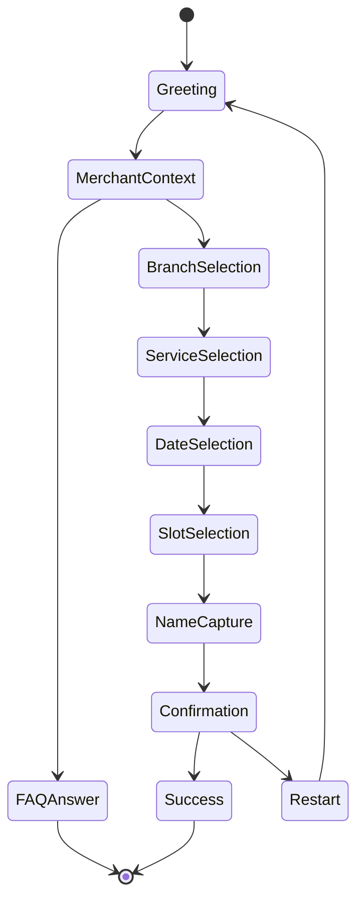

# AI Booking Flow

Dokumen ini menjelaskan alur percakapan booking yang lebih spesifik, dari sapaan awal sampai booking berhasil dikonfirmasi.

Alur ini dibuat untuk model:

- 1 WhatsApp Official shared assistant
- banyak merchant di belakangnya
- AI dipakai untuk memahami intent dan menjawab FAQ
- database dipakai sebagai sumber kebenaran
- booking final tetap divalidasi engine

## 1. Flow Overview



## 2. Entry Conditions

Flow dimulai saat:

- customer mengirim pesan pertama ke nomor shared official
- customer membalas pesan lanjutan dari sesi booking yang masih aktif
- customer mengetik `halo`, `menu`, atau `booking`
- customer meminta ulang pilihan lewat `lanjut`

## 3. Step-by-Step Flow

### Step 1. Greeting

Tujuan:

- membuka percakapan
- mengidentifikasi merchant mana yang sedang dibahas
- mengarahkan user ke FAQ atau booking flow

Input:

- pesan awal seperti `halo`
- metadata official phone number id
- sender WhatsApp

AI / system behavior:

- resolve merchant context dari database
- ambil nama bisnis, cabang aktif, layanan aktif, jam operasional, dan hari libur
- tentukan apakah user perlu:
  - FAQ answer
  - branch selection
  - booking flow

Output:

- greeting singkat
- pilihan cabang jika merchant punya banyak cabang
- atau daftar layanan jika hanya satu konteks aktif

State:

- `pilih_cabang` jika merchant punya beberapa cabang
- `pilih_layanan` jika langsung bisa lanjut ke layanan

### Step 2. Merchant Context Resolution

Tujuan:

- memastikan AI tidak mencampur merchant A dan merchant B

Data yang dibaca:

- `whatsapp_channels`
- `dashboard_users`
- `user_profiles`
- `user_branches`
- `user_services`
- `user_landing_pages`
- business hours
- holiday / libur jika tersedia di DB

Guardrail:

- kalau merchant tidak ditemukan, jangan menjawab seolah-olah tahu
- kalau data belum lengkap, minta klarifikasi atau arahkan ke admin

### Step 3. Branch Selection

Kapan muncul:

- merchant punya lebih dari satu cabang

Input user:

- nomor cabang
- nama cabang
- kode cabang

AI / system behavior:

- validasi pilihan cabang
- simpan `branch_id`
- reset `layanan`, `tanggal`, `jam`, `customer_name`

Output:

- konfirmasi cabang terpilih
- ulang daftar layanan yang relevan

State:

- `pilih_layanan`

### Step 4. Service Selection

Tujuan:

- user memilih layanan yang ingin dibooking

Input user:

- nomor layanan
- nama layanan
- kode layanan

AI / system behavior:

- cocokkan input ke layanan aktif merchant
- baca harga dan durasi dari DB
- siapkan daftar tanggal yang masih tersedia berdasarkan durasi layanan

Output:

- nama layanan yang dipilih
- tanggal yang tersedia

State:

- `pilih_tanggal`

### Step 5. Date Selection

Tujuan:

- user memilih tanggal booking

AI / system behavior:

- generate daftar tanggal yang valid
- periksa business hours dan hari libur
- periksa slot yang masih tersedia untuk merchant dan cabang tersebut

Input user:

- nomor tanggal
- format `YYYY-MM-DD`

Output:

- tanggal terpilih
- daftar jam yang tersedia pada tanggal itu

State:

- `pilih_jam`

### Step 6. Slot Selection

Tujuan:

- user memilih jam booking

AI / system behavior:

- generate daftar slot valid
- cek lagi ketersediaan slot real-time
- pastikan tidak bentrok dengan booking aktif lain

Input user:

- nomor slot
- jam spesifik

Validation:

- jika slot sudah terisi, minta pilih slot lain
- jika slot valid, lanjut ke nama pemesan

Output:

- jam yang dipilih
- prompt untuk isi nama pemesan

State:

- `isi_nama`

### Step 7. Name Capture

Tujuan:

- mengikat booking ke identitas customer

Input user:

- nama pemesan

Validation:

- nama minimal 2 karakter
- nama di-normalize sebelum disimpan

Output:

- ringkasan booking sementara
- permintaan konfirmasi final

State:

- `konfirmasi`

### Step 8. Confirmation

Tujuan:

- final check sebelum data booking disimpan

AI / system behavior:

- susun ringkasan:
  - merchant
  - cabang
  - layanan
  - tanggal
  - jam
  - harga
  - nama pemesan
- minta user balas `YA` untuk finalisasi atau `BATAL` untuk mengulang

Validation before save:

- cek ulang slot masih tersedia
- cek konflik booking
- cek state masih valid

Jika sukses:

- insert booking ke database
- set status `confirmed`
- clear session state
- kirim pesan sukses

Jika gagal:

- clear session state
- minta user mulai ulang

State:

- `konfirmasi` lalu `Success` atau `Restart`

## 4. Supported Shortcuts

Flow juga mendukung shortcut berikut:

- `halo`
- `menu`
- `booking`
- `lanjut`
- `batal`
- `cabang`
- `industri`

Shortcut ini berguna untuk:

- restart flow
- pindah step
- memperbaiki sesi yang tersesat

## 5. Booking Safety Rules

- satu booking tidak boleh menimpa booking aktif lain
- slot harus divalidasi sekali lagi sebelum insert final
- AI tidak boleh menulis data booking tanpa lewat engine
- data merchant harus diambil dari DB per tenant
- jika data tidak cukup, minta klarifikasi, jangan menebak

## 6. Fallback Paths

### Fallback A. Merchant has no branches

- skip branch selection
- langsung ke service selection

### Fallback B. No available dates

- tampilkan pesan bahwa belum ada tanggal tersedia
- arahkan user ke admin atau minta coba lagi nanti

### Fallback C. Slot taken at final confirm

- batalkan sesi
- minta user mulai lagi

### Fallback D. Unknown intent

- berikan jawaban FAQ singkat
- atau tampilkan menu booking ulang

## 7. Example Conversation

```text
Customer: halo
Bot: Halo, pilih cabang dulu ya...

Customer: 1
Bot: Cabang dipilih...
     sekarang pilih layanan...

Customer: 2
Bot: Tanggal tersedia...

Customer: 1
Bot: Jam tersedia...

Customer: 3
Bot: Sekarang balas dengan nama pemesan...

Customer: Ahmad
Bot: Konfirmasi booking...

Customer: YA
Bot: Booking berhasil!
```

## 8. Why This Flow Works for Shared AI

Flow ini cocok untuk model shared assistant karena:

- AI hanya dipakai di titik yang memang butuh bahasa fleksibel
- data bisnis tetap terpisah per merchant
- booking tetap aman walaupun banyak merchant memakai satu nomor platform
- onboarding merchant jadi lebih sederhana daripada membuat bot terpisah per merchant

